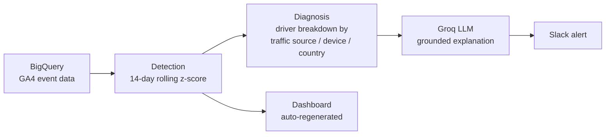
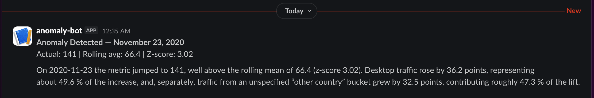

# Driftline

**Detects e-commerce anomalies, explains them from real numbers only, runs itself daily.**

**Live dashboard:** https://swwapniill.github.io/Driftline/

---

## What this is

Most "AI-powered analytics" projects bolt an LLM onto a dashboard and call it insight. Driftline is built the other way round: a real statistical detection layer finds genuine anomalies in daily e-commerce metrics, a separate diagnostic layer breaks down *where* the change came from, and only then does an LLM turn that into plain-language explanation — one that's not allowed to invent a cause it wasn't given data for. The whole chain runs on a daily schedule, unattended, and posts straight to Slack.

Built on the public **GA4 obfuscated sample e-commerce dataset** (`bigquery-public-data.ga4_obfuscated_sample_ecommerce`), covering Nov 1, 2020 – Jan 31, 2021.

## Architecture

Runs daily via **GitHub Actions** (cron `0 6 * * *`, plus manual trigger with a test-date override). Each run: pulls the day's data, checks for an anomaly, diagnoses the driver if one's found, generates a grounded explanation via Groq, posts to Slack, and regenerates the live dashboard — all in one workflow, no manual step.

## Why the "daily" pipeline runs on 2020-2021 data

The dataset is frozen — it doesn't get new rows. Rather than fake real-time freshness, the pipeline maps the real calendar date to a historical date using a stateless offset (`real_date - anchor_date, mod 92 days`), so it cycles through the full dataset once every 92 days of actual runtime. This is documented, not hidden: see [Known limitations](#known-limitations).

## Detection methodology

- **Metric:** daily purchase events, aggregated from raw GA4 event data
- **Detection:** 14-day rolling mean + standard deviation, flagged as anomalous at |z-score| > 1.8 (tuned by manually verifying flagged dates against a visual inspection of the full trend — not left at a default)
- **Diagnosis:** for each anomaly, purchases are broken down by traffic source, device type, and country. The "top driver" is the dimension value with the largest **contribution to the total change** (not raw change, and not share-of-total — both were tried first and rejected because they favored dimensions with fewer categories; see limitations)
- **Dataset result:** 9 anomalies detected — 8 spikes (Black Friday week, a January bump) and 1 dip (a mid-December drop)

## Grounded explanation layer

The LLM (Groq, `openai/gpt-oss-120b`) only ever receives the structured diagnosis JSON — no raw data, no access to search or outside context. Its system prompt enforces:
- Only cite numbers actually present in the input
- Never invent an external cause (no holidays, promotions, news events) unless it's in the data
- State plainly when a driver is unclear (a catch-all "other" bucket) or when there isn't enough historical data to judge yet
- Never imply that two different dimensions' contribution percentages add up to "explain" the total change — they're separate lenses on the same day, not additive shares

Tested against 5 required edge cases before being trusted in production:

| Case | Result |
|---|---|
| Clear single driver | ✅ Cites exact numbers, no invented cause |
| Catch-all / unclear category | ✅ Explicitly flags the category as unclear |
| No dominant driver | ✅ States there's no single cause upfront |
| Insufficient baseline data | ✅ Declines to attribute a cause, explains why |
| Conflicting signals (one dimension up, another down) | ✅ Names the conflict instead of blending it into one story |

**Honest note:** this specific dataset's real anomalies never naturally produced the "no dominant driver" or "conflicting signals" cases — every real spike/dip here has a clear, concentrated cause. Both were validated with hand-built synthetic input instead of a real example. This is disclosed on the dashboard and here, not hidden.

### Real example (from the live dataset)

> On 2020-11-23 the metric jumped to 141, well above the rolling mean of 66.4 (z-score 3.02). Desktop traffic rose by 36.2 points, representing about 49.6% of the increase, and, separately, traffic from an unspecified "other country" bucket grew by 32.5 points, contributing roughly 47.3% of the lift.

### Synthetic example (no real case in this dataset)

> The increase appears to be spread across multiple factors, so there is no single clear cause. Traffic from Google rose by 8.2 points, accounting for 28% of the change, while mobile device usage grew by 7.5 points, contributing 25.5% of the shift.

## Proof of automation

Real alert, generated by an unattended GitHub Actions run — not staged locally. See the [Actions tab](https://github.com/swwapniill/driftline/actions) for the full run history and logs of every scheduled execution.

## Known limitations

- **Dataset is historical, not live** — "daily" refers to run cadence, not data freshness (see above)
- **Dimension bias in driver detection:** `device_type` has only 3 categories, `country` has 11+; fewer categories means each one absorbs more volume, so device tends to appear as the "top driver" more often — not because it's structurally more important, but because it's less fragmented. Contribution-by-delta was chosen specifically to reduce (not eliminate) this bias.
- **Contribution percentages aren't mutually exclusive across dimensions** — a device breakdown and a country breakdown are two separate lenses on the same day, not two slices of one pie. The LLM is explicitly instructed not to sum them.
- **"No dominant driver" and "conflicting signals" cases** were validated with synthetic input only, since no real anomaly in this dataset triggered them naturally.
- **Groq model availability:** Groq occasionally retires model names; the pipeline uses `openai/gpt-oss-120b`, confirmed live via `client.models.list()` at time of writing — a future run failure on this point is a known, checkable risk.

### How this would be validated in production

Everything in this project — the z-score threshold, the "concentrated vs distributed" cutoff, which dimensions matter — was decided by me alone, checked against visual inspection of the trend, not against real business judgment. In an actual production deployment, thresholds like these would be tuned against what an ops or growth team actually considers a false positive versus a real signal, and the diagnostic dimensions would be chosen based on what stakeholders act on, not just what happened to be in the schema. This project demonstrates the detection and explanation *mechanism*; the *thresholds* would need real stakeholder input before being trusted at face value.

## Things that broke, and how they got fixed

Kept here honestly rather than presenting a cleaned-up story that skips the real debugging:

- **Wrong GCP project:** created the service account in Google's auto-generated default project instead of the one actually meant for this project — caught by checking the Service Accounts page under the correct project and finding it empty, then rebuilding the service account in the right place.
- **Empty/malformed secret in GitHub Actions:** writing the BigQuery key via `echo '${{ secrets.X }}'` silently produced a corrupted or empty file due to shell quoting — fixed by writing it through an environment variable with `printf '%s'` instead, plus an explicit JSON-validation step in the workflow so this fails loudly next time, not silently.
- **Hidden Unicode character in a copied API key:** a Groq API key copied from a text file carried an invisible `\u2028` line-separator character, which broke HTTP header encoding deep inside the API client with a cryptic `UnicodeEncodeError`. Fixed by re-copying the key cleanly and adding `.strip()` on every API key/URL read from environment variables as a permanent safeguard.
- **Renaming the project folder broke the virtual environment:** renaming the local folder via Finder left `venv`'s activation script pointing at hardcoded absolute paths to the old folder name, silently falling back to system Python. Fixed by deleting and rebuilding the venv fresh inside the renamed folder — and learned not to rename a project directory after `venv` setup without doing this.
- **GitHub Pages folder restriction:** initially built the dashboard into a folder named `dashboard/`, only to find GitHub Pages' "deploy from branch" option only supports the repo root or a folder literally named `docs/`. Renamed the output path accordingly.

## Tech stack

- **Data:** Google BigQuery, GA4 public sample dataset
- **Detection & diagnosis:** Python, pandas
- **LLM:** Groq (`openai/gpt-oss-120b`)
- **Automation:** GitHub Actions (scheduled + manual trigger)
- **Alerting:** Slack incoming webhook
- **Dashboard:** static HTML + Plotly, published via GitHub Pages, auto-regenerated by the same pipeline run

## Running it yourself

1. Create a GCP project, enable the BigQuery API, create a service account with BigQuery Admin access, download its JSON key
2. Create a Groq API key at console.groq.com
3. Create a Slack incoming webhook for a channel of your choice
4. Add all three as GitHub repository secrets: `GCP_SA_KEY`, `GROQ_API_KEY`, `SLACK_WEBHOOK_URL`
5. Run `build_daily_table.py` once to build the summary table this pipeline queries
6. The `daily-pipeline.yml` workflow handles the rest — trigger it manually with a `test_date` input to see it work end-to-end before waiting on the schedule
